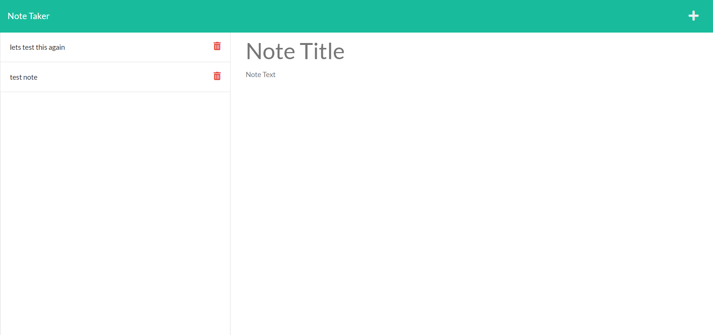

# Amazing README Generator
  

     
  ## Description
   This is a simple note keeping app. It saves notes on a heroku server and allows you to edit and delete old notes.
   
      
 
 
  * [Description](#description)
  * [Installation](#installation)
  * [Usage](#usage)
  * [License](#license)
  * [Contributors](#contributors)
  * [Testing](#testing)
  * [Questions](#questions)
      
    

  ## Installation
  Simply go to https://guarded-lake-20168.herokuapp.com/ to use the app.
    
   ## Usage
      
  After clicking the get started button, you will be taken to the notes page. On the notes page you can click on old notes to edit or delete them. You can also make a new note and save it to the server by clicking the save icon in the top left once the note has a title and text.

  ## License
This software is licensed under the Unlicense license.
   
  ## Contributors
  Matt11711

 
  ## Testing
         
  No tests currently.
   
  ## Questions
  Check out my GitHub profile at https://github.com/Matt11711
        
  Or contact me at matthew.d.allen97@gmail.com
  